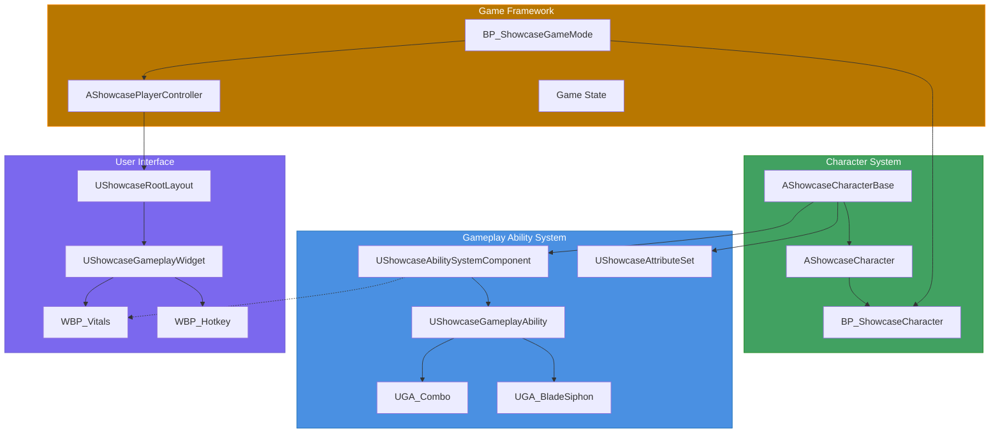
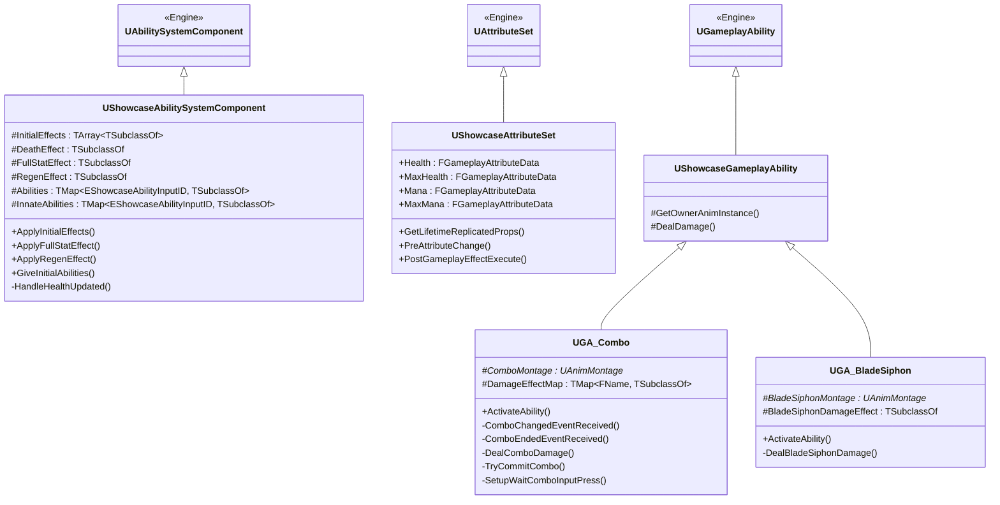
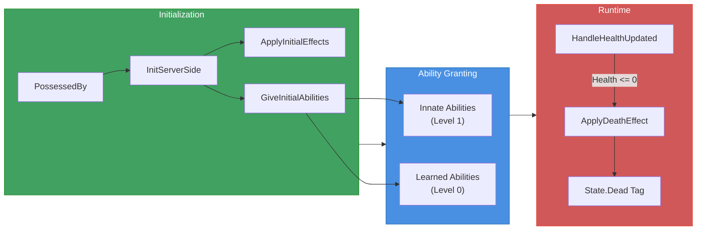
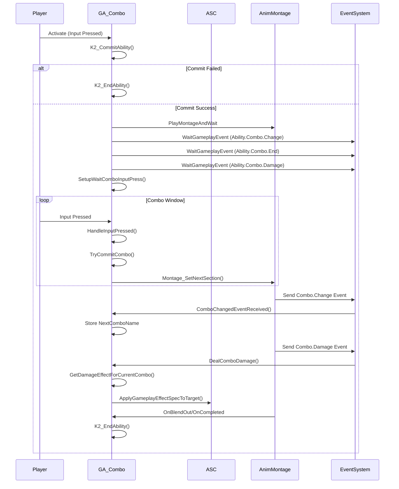
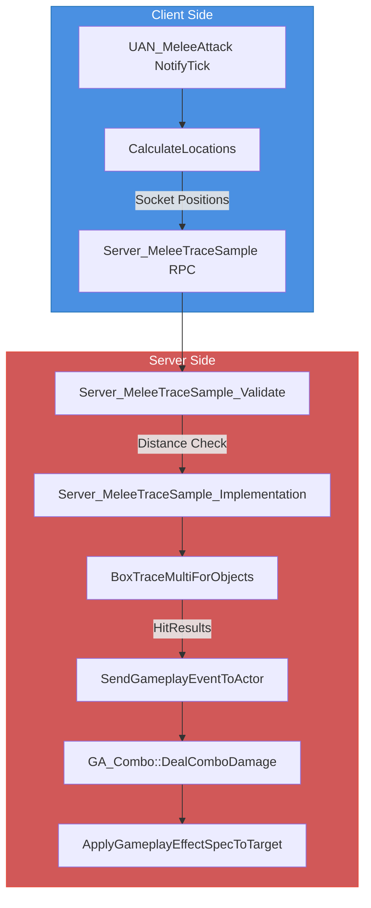

# Showcase

## How To

In order for the project to work properly, clone the repo and download the modified Paragon Countess files from [here](https://drive.google.com/drive/folders/1f9LdhPV0E4tEvA4hN1c2fIaQLjMbFQlC?usp=sharing) and extract them. Then in the repo's `Content` folder paste the extracted `ParagonCountess` folder.

A project I put together to demonstrate GAS architecture and melee combat implementation. Standard practices are used, more of which can be found in tranek’s (or any other) guide,  multiplayer-ready, and server-authoritative ability design.

## Core GAS Architecture

The Owner and Avatar actor in this project is for both the pawn since I wouldn’t need the strict death and respawn architecture for this project.

## Attribute Set

Attribute set consists of four attributes healt and mana and their max counterparts. PreAttributeChange was overriden for the initial clamping and PostGameplayEffectExecute for the final authoritative one. The later in it’s current state doesn’t really serves any purpose, but it is good to be there.

## Ability System Component

Ability system component is initialized on OnPossess for the server and on AcknowledgePossession for the client. Even though there isn’t any AIController currently, the AI’s component is initialized on PossessedBy where also a check is made to ensure this isn’t any listen server’s pawn. Some gameplay effects and abilities are hard referenced here to be applied on spawn, which should be okay for the small amount this project offers, but in a proper framework I usually would go for attaching them through data assets.

## Gameplay Abilities

`UGA_Combo` is innate and the auto-attack. It uses sections from the corresponding anim montage to play the next animation if timed properly. Damage inflicted differs depending on the combo. Anim notifies and notify states where used for this as well as to hit trace and inflict damage. 

`UGA_BladeSiphon` is “learnt” and activated on input. It consumes the mana attribute and also has a cooldown to it.

Damaging abilites use socket-based tracing. This can arguably be bad due to fps drops that can happen on client or even susceptible to cheating since in the server validation I am currently only testing if the begin and end-point have distance with a small relative error and not if their locations are within a radius of the chasracter inflicting the damage. But again for this scenario it should be enough.

Gameplay cues where used to indicate when hits landed and camera shakes to have some feedback that you were hit.

## Ability Activation

Enums are used to bind inputs to abilities. Another better alternative would be to use gameplay tags for this.

## Gameplay Effects

A variety was used for attribute regenaration, damage application, applied on spawn or after an ability.

## GAS-Driven visuals

In the `UShowcaseAttributeWidget`, the widget binds directly to the `FGameplayAttibute` references through the attribute change delegates. That way the attribute is specified through the widget making it agnostic in a sense.

For the activated abilities, a not so clean way was used of using ability CDOs in widgets to listen for ability activations. This would be better of using a system such as Lyra’s messaging plugin which solves this issue minimally and without any hard references.

## // TODO

The rest of the classes can be observed in the git repo as they are beyond the current scope. It won’t be updated as it is okay for what it is and also serves as a personal look-back.

If you want to talk about this or how things could be differently, you can reach out to me.

>All Rights Reserved
>
>Copyright (c) 2026 Spyridon Zervos
>
>This repository is provided for viewing and evaluation purposes only.
>
>No permission is granted to use, copy, modify, merge, publish, distribute,
>sublicense, or sell any part of this software or its assets, in whole or in part.
>
>This project is intended solely as a personal portfolio showcase.
